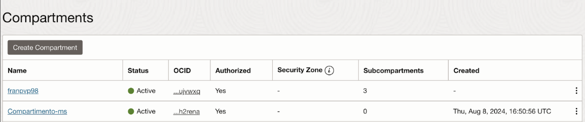
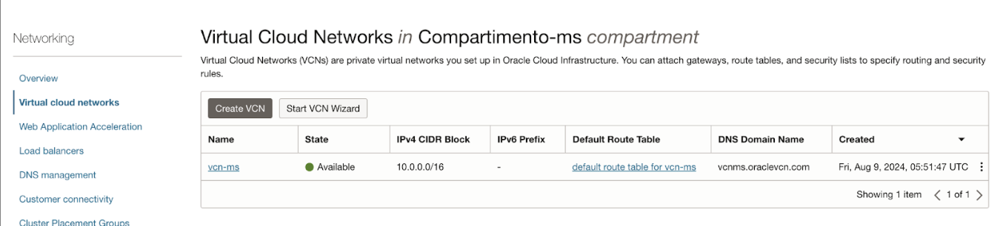
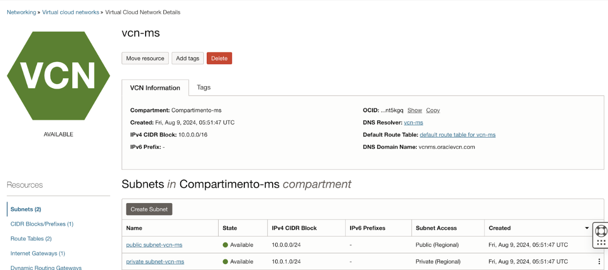
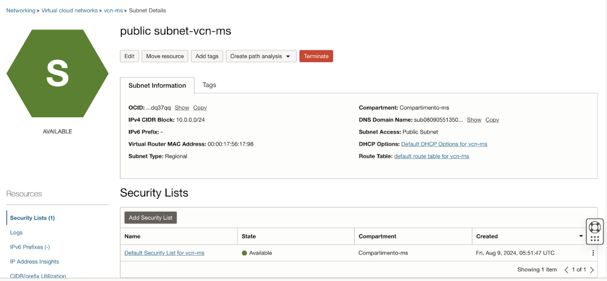
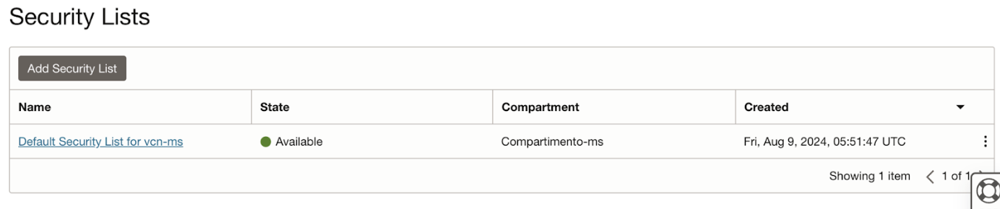
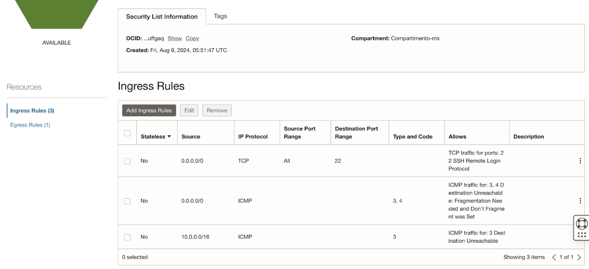
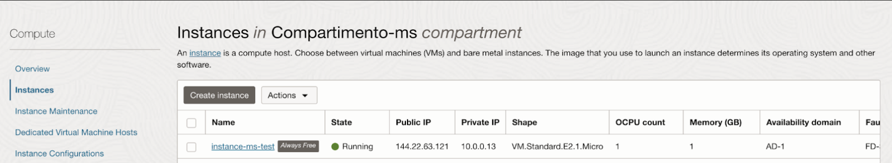
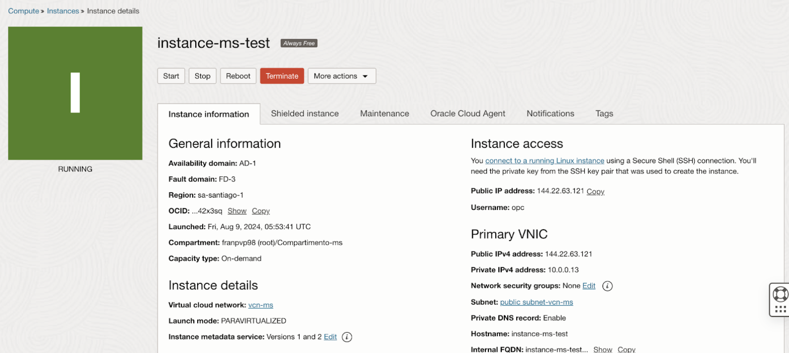

# Proyecto Despligue Microservicio a OCI
El objetivo principal de este proyecto es mostrar en detalle los pasos que se siguieron a la hora de desplegar un microservicio desarrollado con Java y Spring Boot a la nube de OCI (Oracle Cloud Infrastructure).

### Pasos a seguir para desplegar microservicio en OCI:

1. En primer lugar, se requiere de la creación de una cuenta, en este caso, se creó una cuenta gratuita.
2. Una vez creada la cuenta, se debe crear un compartimento o **Compartments** para almacenar los recursos que se vayan creando:

   
    

      Figura N° 1: Listado de Compartimentos
       
       
    

    
4. Luego, se continúa con la creación del VCN o Virtual Cloud Network, cuando se genera este VCN, por defecto se crean dos subredes o subnets, una pública y otra privada:

  
    

      Figura N° 2: VCN en Compartimento-ms
       
       
    

    
5. Nos dirigimos ahora a la sección de **Security List**, el cual en la parte inferior en **Ingress Rules** debemos añadir una nueva regla de seguridad, tal como se muestra en la siguiente imagen:

   
    

      Figura N° 3: Resultados creación de VCN denominada <code>vcn-ms</code>
       
       
    

    
6. Finalmente, se procede a la creación de la instancia o máquina virtual, el cual se muestra a continuación:

  
    

      Figura N° 4: Detalles subred pública public <code>subnet-vcn-ms</code>
       
    

***Importante: Cuando se crea una instancia se debe guardar el SSH key tanto el privado como el púlbico, ya que es requerido para efectuar la conexión a la instancia.***

Adicionalmente, se puede observar la sección de “Security List”, las cuales son las reglas de seguridad, en donde se pueden realizar modificaciones con respecto a los puertos que se pueden habilitar para tener acceso a estos.

  
  

      Figura N° 5: Security Lists de <code>vcn-ms</code>
       
       
    

  
En la siguiente figura se aprecian los “Ingress Rules” o Reglas de ingreso. Estas reglas permiten especificar desde qué direcciones IP se puede acceder a un recurso y a través de qué protocolos y puertos.

  
    

        Figura N° 6: Ingress Rules de <code>vcn-ms</code>
         
         
      

Finalmente, se crea la instancia o máquina virtual, este se crea pulsando el botón de “Create instance”. Una vez generada, se ingresa a la sección de “Compute”, luego en Instance, desplegando lo siguiente:

    

        Figura N° 7: Instancias en Compartimento-ms
         
      

A continuación, en la terminal debemos ubicarnos en la carpeta donde tenemos el SSH key privado y público, el cual es obtenido cuando se está creando la instancia: 

  Figura N° 8: Detalles de instancia <code>instance-ms-test</code>
   
   

Para conectarse a la instancia creada, en primer lugar, se necesita la IP pública y el Username, los cuales se pueden visualizar en la **Figura N°8**.
A continuación, en la terminal debemos ubicarnos en la carpeta donde tenemos el SSH key privado y público, el cual es obtenido cuando se está creando la instancia: 

  <code> -> <strong>instance-ms-test</strong> ssh -i ssh-key-2024-08-09.key opc@144.22.63.121 </code>
   
   

Al intentar conectarse a la máquina se presentaron ciertas dificultades. En primera instancia, se presencia un error en el servicio de red, llamado `network.service`, y otro error de caché, 
denominado como `dnf-makecache.service`, los cuales se corrigen mediante los siguientes comandos:

Surgió un error en el servicio de red llamado `network.service`, el cual es mitigado por medio del siguiente comando:

  <code> -> <strong>instance-ms-test</strong> sudo systemctl restart network.service </code>
   
   

El comando anterior, permite reiniciar el servicio `network.service`, para luego revisar su estado con el comando de a continuación:

  <code> -> <strong>instance-ms-test</strong> sudo systemctl status network.service </code>
   
   

Finalmente, se reinicia la máquina virtual para aplicar los cambios.

  <code> -> <strong>instance-ms-test</strong> sudo reboot </code>
   
   

Para la solución del problema con `dnf-makecache.service`, se requiere ejecutar el siguiente comando, 
con el fin de verificar el uso actual de la memoria para ver si están agotados los recursos de la máquina virtual o instancia: 

  <code> -> <strong>instance-ms-test</strong> free -m </code>
   
   

Una vez ejecutado el comando y ver si tiene recursos disponibles para ejecutar la aplicación, 
en caso de no tener suficientes recursos, se tendrán que ejecutar los siguientes comandos en la instancia:

  <code> -> <strong>instance-ms-test</strong> sudo fallocate -l 1G /swapfile </code> 
  <code> -> <strong>instance-ms-test</strong> sudo chmod 600 /swapfile </code> 
  <code> -> <strong>instance-ms-test</strong> sudo mkswap /swapfile </code> 
  <code> -> <strong>instance-ms-test</strong> sudo swapon /swapfile </code>

Estos comandos van a asignar 1 giga de memoria física (RAM) a la máquina virtual.

Una vez con memoria disponible, se requiere efectuar un actualización de la instancia para que se realicen los cambios realizados, mediante el siguiente comando:

  <code> -> <strong>instance-ms-test</strong> sudo dnf update dnf </code>
   
   

Luego, verificamos los logs del sistema, con el fin de revisar si hay alguna incidencia:

  <code> -> <strong>instance-ms-test</strong> sudo journalctl -xe </code>
   
   

Se prosigue con el reinicio del servicio de dnf-makecache.service, para efectuar cambios:

  <code> -> <strong>instance-ms-test</strong> sudo systemctl restart dnf-makecache.service </code>
   
   

Y se revisa el estado con el siguiente comando:

  <code> -> <strong>instance-ms-test</strong> sudo systemctl status dnf-makecache.service </code>
   
   

Finalmente reiniciamos la máquina nuevamente con “sudo reboot” para garantizar la actualización realizada previamente de los recursos de la máquina virtual.

